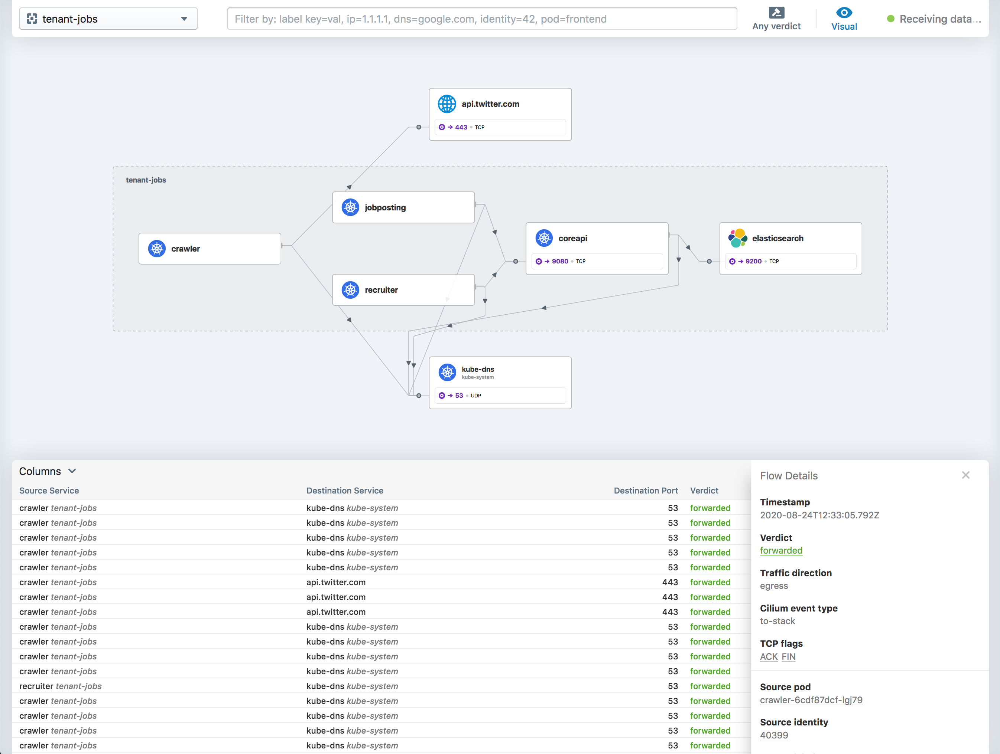

# Hubble UI

Hubble UI is open source user interface for [Cilium Hubble](https://github.com/cilium/hubble).

## Installation

Hubble UI is installed as part of hubble, please see [Hubble Service Map Tutorial](https://github.com/cilium/hubble/blob/master/tutorials/deploy-hubble-servicemap/README.md) for details.

## Why Hubble UI?

Troubleshooting microservices application connectivity is a challenging task. Simply looking at "kubectl get pods" does not indicate dependencies between each service or external APIs or databases.

Hubble UI enables zero-effort automatic discovery of the service dependency graph for Kubernetes Clusters at L3/L4 and even L7, allowing user-friendly visualization and filtering of those dataflows as a Service Map.

See [Hubble Service Map Tutorial](https://github.com/cilium/hubble/blob/master/tutorials/deploy-hubble-servicemap/README.md) for details.

### Development

1. Clone hubble as submodule `git submodule update --init --recursive`
2. Install deps for backend and frontend `npm run install:all`
3. Build client code first time `cd client && npm run build`
4. Run backend: `cd server && npm run build && npm run watch`
5. Run frontend in separate terminal: `cd client && npm run start`
6. Open [http://localhost:12000](http://localhost:12000)

## Community

Learn more about [Cilium Community](https://github.com/cilium/cilium#community)

## License

Hubble UI is  [Apache License, Version 2.0](https://github.com/cilium/hubble-ui/blob/master/LICENSE)